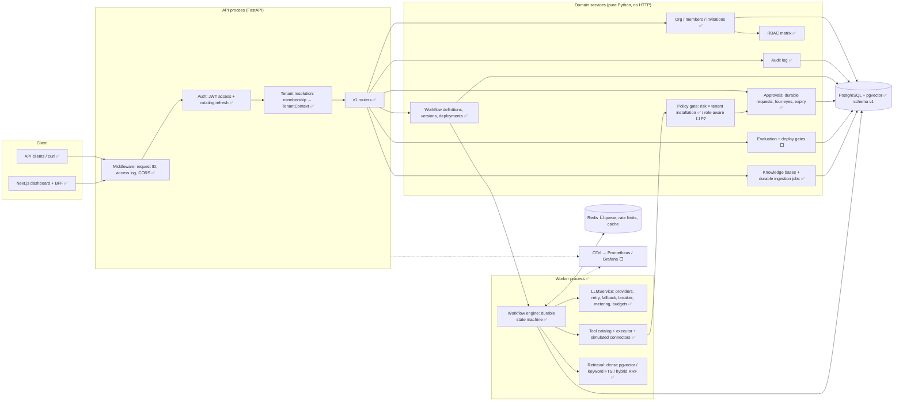
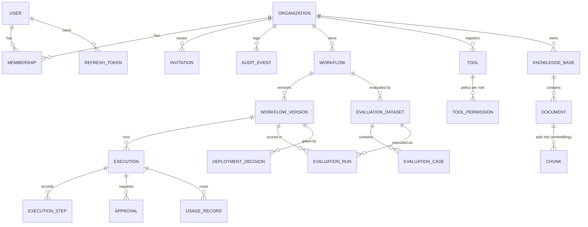
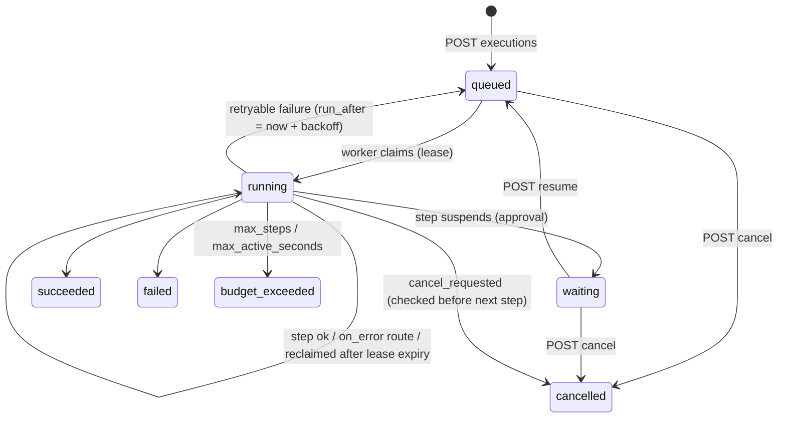
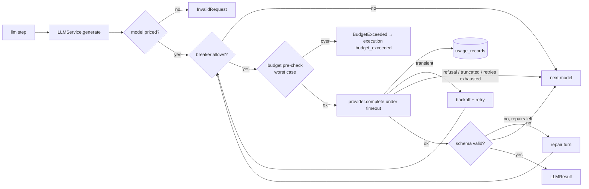
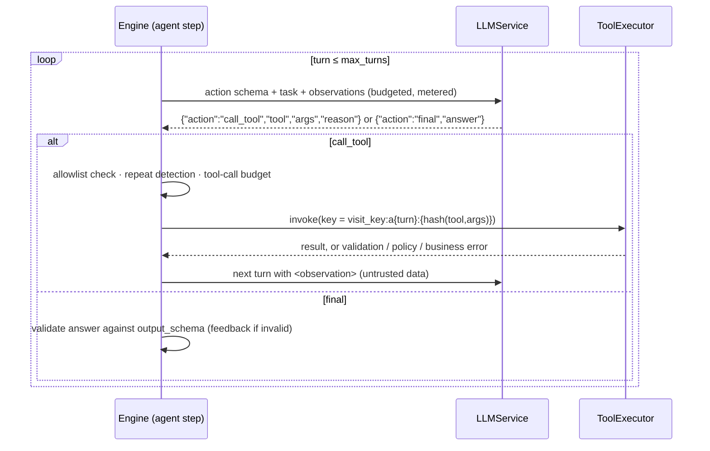
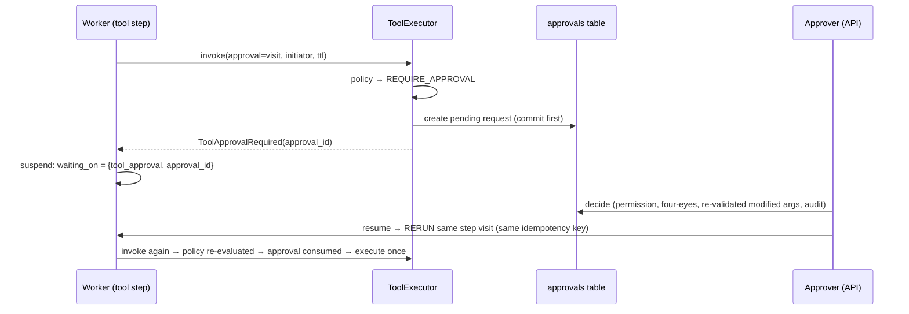
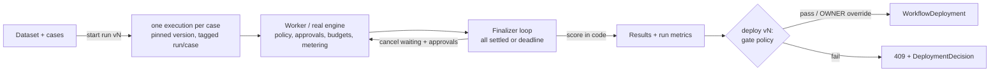

# SolutionForge Architecture

> Status markers: ✅ implemented and tested · 🟡 partially implemented · ⬜ designed, not built yet.
> This document is the design of record. Anything marked ⬜ is a plan, not a claim.

## 1. Product architecture

SolutionForge lets an organization deploy **AI workflows** that act on **its own data and
tools** under **deterministic policy**, with **human approval** for risky actions, and with
**evaluation gates** that block regressions from reaching production.

The core bet is that an AI workflow should be managed like any other production software: it is
versioned, tested against a dataset, permission-checked, observable, and rolled back when it
gets worse.

```
User request ─▶ API gateway ─▶ AuthN + tenant resolution ─▶ Workflow engine
                                                                 │
               ┌─────────────────────────────────────────────────┤
               ▼                     ▼                           ▼
          LLM provider         Retrieval (RAG)            Tool registry
          abstraction          pgvector + BM25            (connectors, MCP)
               │                     │                           │
               └──────────────┬──────┴───────────────────────────┘
                              ▼
                  Policy engine (deterministic) ──▶ Approval queue (HITL)
                              │
                              ▼
                  External action ─▶ Response ─▶ Evaluation / traces / metrics / audit
```

The architecture is a **modular monolith**: one deployable API, one worker, and hard internal
module boundaries (see [ADR-0001](docs/adr/0001-modular-monolith.md)). Services only become separate
deployables when there's a measured reason.

## 2. Component diagram



**Dependency rule:** `api → services → (domain, db, security)`. Services never import FastAPI.
The worker calls the same services the API does, so authorization and tenancy checks apply
whatever the entry point.

## 3. Database domain model



| Entity | Status | Notes |
|---|---|---|
| User, Organization, Membership, Invitation, RefreshToken | ✅ | migration `0001` |
| AuditEvent | ✅ | append-only; PG trigger rejects UPDATE/DELETE |
| Workflow, WorkflowVersion, WorkflowDeployment, Execution, ExecutionStep | ✅ | migration `0002`. Versions are immutable. Deployments are append-only (rollback = new row). A PG trigger rejects UPDATE on execution_steps |
| ToolInstallation, ToolCall | ✅ | migration `0004`. Per-tenant opt-in with encrypted credentials. The call trail is unique on `(org, tool, idempotency_key)` |
| Sim* (customers, orders, tickets, messages, refunds) | ✅ | stand-ins for customer systems: real tenant-scoped tables behind the tool interface |
| Approval | ✅ | migration `0007`. One per (execution, step, visit). Proposed and approved (possibly modified) args, required approver permission, expiry, consumption |
| KnowledgeBase, Document, Chunk | ✅ | migration `0005`. `vector(1024)` + HNSW (cosine) and a GIN full-text index on PG. Documents carry their ingestion job state (lease, attempts, dead letter) |
| EvaluationDataset/Case/Run, DeploymentDecision | ⬜ Phase 11 | |
| UsageRecord, OrgBudget | ✅ | migration `0003`. One row per provider attempt (success or failure), integer micro-USD, with no prompt or output content |

**Tenancy invariant.** Every tenant-owned table inherits `TenantScopedMixin`
(`organization_id NOT NULL`, FK `ON DELETE CASCADE`, indexed). You can only get a
`TenantContext` from `org_service.resolve_tenant`, which proves membership. Queries go through
`scoped_select(model, ctx, ...)`, which always adds the org filter. PostgreSQL Row-Level
Security is planned as a second layer (see [ADR-0004](docs/adr/0004-tenant-isolation.md)).

## 4. Repository structure

```
solutionforge/
├── apps/
│   ├── api/                      Python package `solutionforge` (API + worker share it)
│   │   ├── src/solutionforge/
│   │   │   ├── api/              HTTP only: routers, deps, error mapping, middleware
│   │   │   ├── core/             config, errors, logging, clock
│   │   │   ├── db/               base types, session factory, tenancy helpers
│   │   │   ├── domain/           ORM entities
│   │   │   ├── schemas/          Pydantic request/response models
│   │   │   ├── security/         RBAC, passwords, tokens  (policy engine lands here)
│   │   │   ├── services/         use cases; enforce permissions
│   │   │   ├── workflows/  ⬜    engine, step types, state
│   │   │   ├── llm/        ⬜    provider abstraction, metering
│   │   │   ├── tools/      ⬜    tool interface, registry, connectors, MCP adapter
│   │   │   ├── retrieval/  ⬜    ingestion, chunking, embeddings, search
│   │   │   ├── evaluation/ ⬜    datasets, scorers, gates
│   │   │   └── observability/ ⬜ OTel setup, metrics
│   │   ├── migrations/           Alembic
│   │   └── tests/{unit,integration,security}/
│   └── web/                ⬜    Next.js + TypeScript dashboard
├── infra/docker/                 Dockerfiles   (terraform/ later)
├── docs/                         ARCHITECTURE, BACKLOG, adr/, diagrams/
├── .github/workflows/            CI
└── docker-compose.yml
```

Why this differs from the suggested `packages/*` layout: in Python, several separately
installable packages add packaging overhead without adding isolation. A single package with
enforced layering gives the same boundaries. An import-linter contract (backlog) will make the
layering rules machine-checked.

## 5. Core API boundaries

All business routes live under `/api/v1`. Tenant-owned resources are always addressed as
`/api/v1/orgs/{org_id}/...`, so the tenant comes from the URL and is checked against the
caller's membership **before** any handler code runs. It never comes from a request body.

| Area | Routes | Status |
|---|---|---|
| Auth | `POST /auth/register · /auth/login · /auth/refresh · /auth/logout`, `GET /auth/me` | ✅ |
| Orgs | `POST/GET /orgs`, `GET/PATCH /orgs/{org_id}` | ✅ |
| Members | `GET /orgs/{org_id}/members`, `PATCH/DELETE /orgs/{org_id}/members/{user_id}` | ✅ |
| Invitations | `POST/GET /orgs/{org_id}/invitations`, `DELETE …/{id}`, `POST /invitations/accept` | ✅ |
| Audit | `GET /orgs/{org_id}/audit-events` (cursor pagination, type filter) | ✅ |
| Workflows | `POST/GET …/workflows`, `GET …/workflows/{id}`, `POST/GET …/workflows/{id}/versions`, `GET …/versions/{n}`, `POST/GET …/workflows/{id}/deployments` | ✅ |
| Executions | `POST …/workflows/{id}/executions` (idempotency key), `GET …/executions` (filters), `GET …/executions/{id}` (+ steps), `POST …/executions/{id}/cancel`, `POST …/executions/{id}/resume` | ✅ |
| Approvals | `GET …/approvals` (status / execution filters), `GET …/approvals/{id}`, `POST …/approvals/{id}/decision` (`approve`/`reject`, optional modified args) | ✅ |
| Tools | `GET …/tools` (with MCP descriptors), `PUT …/tools/{name}` (enable, policy, config, write-only credentials), `GET …/tool-calls`, `POST …/demo-data`, `GET …/simulated/activity` | ✅ |
| Knowledge | `POST/GET …/knowledge-bases`, `GET/DELETE …/knowledge-bases/{id}`, `POST/GET …/knowledge-bases/{id}/documents` (202, async ingestion, idempotent by content hash), `GET/DELETE …/documents/{id}`, `POST …/documents/{id}/retry`, `POST …/knowledge-bases/{id}/search` | ✅ |
| Evaluation | `…/eval-datasets`, `…/eval-runs`, `…/deployments` (gate decisions) | ⬜ |
| Usage & budgets | `GET …/usage/summary`, `GET …/usage/records`, `GET/PUT …/budget` | ✅ |
| Ops | `GET /healthz` (liveness), `GET /readyz` (DB check), `/metrics` ⬜ | ✅/⬜ |

**Error contract** (every non-2xx response):
`{"error": {"code", "message", "details", "request_id"}}`. Validation errors never echo the
rejected input. 500s never include exception text. Resources in other tenants return **404,
identical to "does not exist"**.

## 6. Workflow execution model ✅ (Phase 2)

A **WorkflowVersion** is an immutable, validated graph of typed steps:

| Step type | Does | Can suspend? |
|---|---|---|
| `transform` ✅ | set state variables or produce output from expressions | no |
| `condition` ✅ | the first matching branch wins (`all`/`any`/`not`, 11 operators, no `eval`) | no |
| `approval` ✅ | human checkpoint; `resume` with `{approved, comment, data}`; `on_reject` route | yes |
| `fail` ✅ | terminate with a coded error | no |
| `llm` ✅ | prompt template (+ optional JSON Schema) → text or validated JSON, via LLMService | no |
| `retrieve` ✅ | dense / keyword / hybrid search with filters and a relevance floor → chunks with IDs and offsets | no |
| `grounded_answer` ✅ | answer only from retrieved chunks; citations restricted by schema **and verified in code**; no sources → no model call | no |
| `tool` ✅ | templated args → ToolExecutor (validate → policy → dedupe → execute → record) | P8 (approval) |
| `agent` ✅ | bounded tool-use loop over an allowlist; every call goes through ToolExecutor + policy gate | P8 (approval) |

**Definitions** (`workflows/definition.py`) are compiled when a version is created. The
compiler rejects unknown step types, invalid configs, dangling `next`/`on_error`/branch
targets, unreachable steps, malformed references, and references to unknown steps or
undeclared inputs, and it reports every error at once.

- Per step: `retry` (attempts, exponential backoff with a cap), `timeout_seconds`, and an
  `on_error` fallback.
- Per workflow: `limits.max_steps` (≤ 1000, retries count) and `limits.max_active_seconds`
  (time spent running steps; time waiting for a human doesn't count).

**Expressions** (`workflows/expressions.py`):

- References: `$.input.x`, `$.state.x`, `$.steps.<id>.x[0]`.
- Templates: `"Hi {{ $.input.name }}"`.
- Evaluation is strict: missing paths and type-mismatched comparisons are errors, not `False`.
- There are no function calls, attribute access or regex, so a definition can't execute code
  or trigger ReDoS.

**Deployments.**

- Creating a version never changes production.
- `POST …/deployments {version}` (needs `workflow:deploy`) appends to an immutable history.
  Production is the newest deployment. Rollback means deploying an older version.
- Running a version that isn't deployed requires `workflow:write`: developers test drafts,
  operators run production.
- Phase 11's quality gate hooks into `deploy`.

**Execution state** (persisted in `executions`): `status, current_step, current_attempt,
input, state, step_outputs, output, error, waiting_on, steps_used, active_ms, event_seq,
cancel_requested, run_after, lease_owner, lease_expires_at, started/finished_at`.



**Durability.** Each step attempt writes one `execution_steps` row (input snapshot, output,
error, tokens, cost, latency, trace/span IDs). It commits **in the same transaction** as the
updated execution state. A crashed worker therefore loses at most the in-flight step, and
another worker resumes from `current_step`. Side-effecting tools receive a deterministic
**idempotency key** (`execution_id:step_id`), so a retried step can't double-send an email or
double-create a ticket.

**Dispatch.** PostgreSQL is the source of truth. See ADR-0003.

- **Claiming.** Workers claim runnable executions with `SELECT … FOR UPDATE SKIP LOCKED` plus
  a compare-and-set. The worker holds a lease sized to the current step's timeout plus a margin.
- **Fenced writes.** Every write checks `WHERE lease_owner = me AND status = 'running'`. A
  worker that stalls past its lease (GC pause, network partition) can't overwrite the progress
  of the worker that took over; its checkpoint is discarded.
- **Poison-pill guard.** The attempt counter is incremented *before* a step runs. A step that
  crashes its worker every time therefore uses up its attempts instead of crash-looping the fleet.
- **Handler isolation.** Handlers get a deep copy of the scope and never a DB session.
- **Redis** (later) is only an optimisation for wake-up latency.

**Guards, checked before every step:** max steps, max wall time, token budget, cost budget
(per execution and per org per day/month). If a guard trips, the execution terminates with
`budget_exceeded` and a recorded reason. It never loops unbounded.

**Policy.** The LLM can only *propose* actions. `PolicyEngine.evaluate(ctx, tool, args)`
returns `ALLOW | REQUIRE_APPROVAL(level) | DENY` from the tool's declared risk level, the
tenant's policy, and the caller's role. It is deterministic code and never consults a model.

| Risk level | Default decision |
|---|---|
| `READ_ONLY` | allow |
| `LOW_RISK_WRITE` | allow or approval, per tenant policy |
| `EXTERNAL_ACTION` | approval (`approval:decide`) |
| `HIGH_RISK` | privileged approval (`approval:decide_high_risk`) |

## 7. LLM layer ✅ (Phase 3)



- **Single entry point.** Everything calls `LLMService.generate`. Vendor SDKs are imported
  only in `llm/providers/`, which a test enforces.
- **Providers.**
  - `mock` is deterministic: by default it returns minimal schema-valid JSON, and it can be
    scripted to fail in every way the service handles.
  - `anthropic` uses the official SDK, with the SDK's own retries **disabled** so every
    attempt is visible to the service and metered exactly once.
- **Metering.** Every attempt, including failed, refused and repaired ones, is written to
  `usage_records` in its own transaction. The ledger never stores prompt or output text.
- **Money.** Costs are integer micro-USD computed from a price table. A model without a price
  can't be used, and definitions naming one fail to compile.
- **Budgets.** Limits are checked **before** each call using a worst-case estimate (input
  estimate plus `max_tokens`):
  - org daily and monthly limits;
  - a per-execution limit, the lower of the org's `per_execution` and the workflow's
    `limits.max_cost_usd`;
  - a per-execution token limit (`limits.max_llm_tokens`).

  A step that trips a budget ends the execution as `budget_exceeded`. It bypasses retries and
  `on_error`, so a fallback path can't keep spending.
- **Failure mapping in workflows.**
  - When every model fails for transient reasons, the step error is retryable, so the
    engine's step retry and backoff apply.
  - Deterministic failures (invalid output after repairs, refusals) are not retryable, so
    they fail fast.

## 8. Tools ✅ (Phase 4)

A tool is a `ToolSpec` plus an async `execute`. The spec declares:

- name and description;
- Pydantic input and output models (`extra="forbid"`, length-bounded strings);
- `risk_level` and `required_permission`;
- timeout and `max_attempts`;
- whether the tool is `idempotent` or `supports_idempotency_key`;
- whether it `requires_credentials`, and which `config_keys` it accepts.

`spec.mcp_descriptor()` emits the MCP `tools/list` shape (`inputSchema`, `outputSchema`,
`annotations.readOnlyHint` / `destructiveHint` / `idempotentHint` / `openWorldHint`).

| Risk | Example | Phase 4 gate |
|---|---|---|
| `read_only` | `crm.get_customer`, `orders.find_delayed` | allow |
| `low_risk_write` | `ticketing.create_ticket`, `email.draft_message` | allow, or approval if the tenant turns off `auto_approve_low_risk` |
| `external_action` | `email.send_message` | approval required (refused until P8 delivers approvals) |
| `high_risk` | `payments.issue_refund` | privileged approval (`approval:decide_high_risk`) |

**Exactly-once side effects, in three layers.**

1. **The engine's key.** Every step visit gets
   `idempotency_key = execution:step:visit_seq`. Retries and crash recovery of the same
   visit reuse it; a loop's next visit gets a new one.
2. **The executor's ledger.** A succeeded `tool_calls` row with that key is replayed, not
   re-executed.
3. **The connector.** Write connectors deduplicate on the key themselves (unique
   constraints), which covers a crash *after* the side effect but *before* the result was
   recorded. Tested: a ticket is created, the worker dies, another worker recovers, and there
   is still exactly one ticket.

Writes that can't deduplicate are never retried by the executor.

## 9. Agents ✅ (Phase 5)



- **Protocol.** Each turn the model returns one schema-constrained JSON action. The schema
  enumerates only the allowlisted tools, and the runner re-checks the allowlist in code. See
  ADR-0009 for why this isn't vendor-native tool calling.
- **Control stays in code.**
  - Policy refusals, argument errors and business errors become observations the model can
    adapt to. They can never be bypassed.
  - Hard caps: `max_turns` (≤ 20), `max_tool_calls` (≤ 50), and at most two identical calls in
    a row. The org, execution and token budgets from Phase 3 apply on every turn.
  - A model that keeps emitting invalid actions fails the step closed.
- **Trace, not thoughts.** Each turn records the action, tool, sanitized args, outcome, and a
  one-sentence reason (≤ 300 chars) the model states for the action. No hidden reasoning is
  stored.
- **Exactly-once.** The key for each agent action includes the turn and a hash of the
  arguments, so a crash-recovered re-run of the same decision replays it. Reusing a key with
  different arguments is rejected (`tool_idempotency_conflict`).

## 10. Retrieval (RAG) ✅ (Phase 6)

See [docs/RETRIEVAL.md](docs/RETRIEVAL.md) for the pipeline, the citation rules, and the
**measured** recall@k and MRR for dense, keyword and hybrid search.

- **Ingestion jobs** reuse the engine's reliability pattern: `SKIP LOCKED` claiming, leases,
  attempts counted at claim time, fenced commits, backoff, and a dead-letter state that can
  be retried via the API. The worker process runs the ingestion loop alongside the execution
  loop.
- **Two backends, one interface.** PostgreSQL uses pgvector, an HNSW index and `tsvector`
  (production). Other dialects use an exact scan and Python BM25 (the fast local test loop).
  CI runs the suite on PostgreSQL. PostgreSQL-only indexes use the `pgx_` prefix and are
  excluded from the drift check.

## 11. Human approvals ✅ (Phase 8)



- **Durable.** The request and the waiting execution are rows, so restarts, closed
  browsers and worker crashes don't lose them. A decision resumes the execution in the same
  transaction it's recorded in.
- **Decision rules live in code** (`services/approval_service.py`):
  - the decider needs the permission the policy assigned;
  - high-risk actions can't be approved by their own requester (four-eyes);
  - modified args are schema-validated;
  - decisions are final;
  - expired requests can't be decided;
  - cancelling an execution cancels its pending requests;
  - the generic `/executions/{id}/resume` refuses tool approvals, so it can't bypass these
    checks.
- **Policy is evaluated again** when the step re-runs. A tool blocked *after* approval stays
  blocked.
- **Agents** don't create approval requests mid-loop. An agent proposes; an explicit `tool`
  step after it requests the approval. This keeps suspend/resume at step boundaries, where
  state is fully checkpointed.

## 12. Dashboard ✅ (Phase 9)

`apps/web` is Next.js (App Router), TypeScript (strict) and Tailwind. It's functional by
design, not decorative.

- **Backend-for-frontend.** Route handlers do login, register and logout and keep the access
  and refresh tokens in **httpOnly SameSite=Lax cookies** (refresh scoped to `/api`).
  Browser code never handles a token.
- **Proxy.** `/api/sf/<path>` → API `/api/v1/<path>`:
  - attaches the bearer token;
  - on a 401, rotates the refresh token once and retries;
  - **requires `x-sf-csrf: 1` on mutating methods**;
  - rejects path segments outside `[A-Za-z0-9._-]`.
- **Gating.** A server layout redirects to `/login` without a session cookie. The API is still
  the authority on every request.
- **Pages:** org picker, overview, workflows (immutable versions, deploy/rollback, run),
  execution timeline (step attempts, agent decision trace, citations, LLM cost, cancel),
  **approvals inbox** (approve / reject / edit args), knowledge (knowledge bases, documents
  with ingestion status, search playground), tools and org policy, usage and budget, audit log.

## 13. Evaluation and deployment gate ✅ (Phase 11)



- **One engine.** Cases are ordinary executions with `evaluation_run_id` and
  `evaluation_case_id`, so scores reflect production behaviour, including policy blocks.
- **Scores come from records:** execution status and output, `tool_calls` (attempted names),
  `llm_usage` (cost and tokens), and `retrieve` / `grounded_answer` step outputs (chunk IDs
  and citations). They're pure functions in `evaluation/scorers.py`.
- **Gate** (`evaluation/gate.py`, enforced in `workflow_service.deploy` via
  `eval_service.enforce_gate`): candidate = the latest completed run of the target version;
  baseline = the latest completed run of the current production version. Every attempt is a
  `DeploymentDecision` row. A block is committed before the 409. See
  [docs/EVALUATION.md](docs/EVALUATION.md) and ADR-0012.

## 14. Cross-cutting decisions

- **Time:** all timestamps are timezone-aware UTC. A `UTCDateTime` column type rejects naive values.
- **IDs:** UUIDv4 everywhere. Nothing sequential is exposed.
- **Transactions:** services own commit boundaries. Audit events are staged in the *same*
  transaction as the action they describe, so both commit or neither does.
- **Config:** 12-factor `SF_*` environment variables. The app refuses to start in
  staging/production without a real JWT secret.
