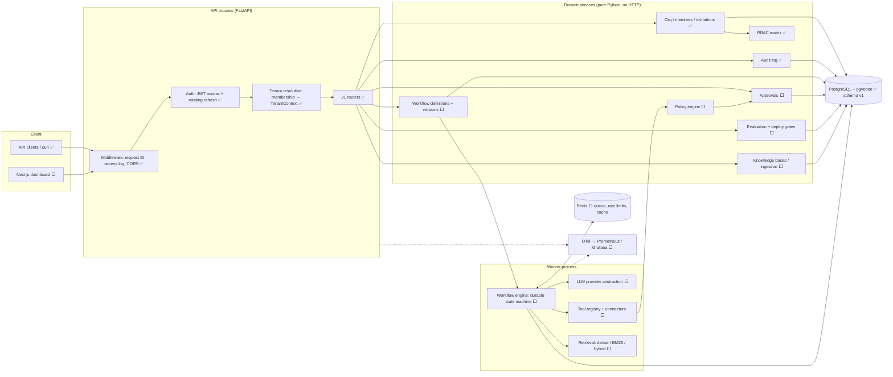
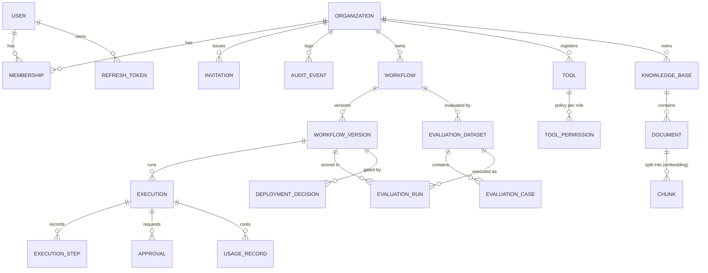

# SolutionForge Architecture

> Status markers: ✅ implemented and tested · 🟡 partially implemented · ⬜ designed, not built yet.
> This document is the design of record. Anything marked ⬜ is a plan, not a claim.

## 1. Product architecture

SolutionForge lets an organization deploy **AI workflows** that act on **its own data and
tools** under **deterministic policy**, with **human approval** for risky actions, and with
**evaluation gates** that block regressions from reaching production.

The core bet is that an AI workflow should be managed like any other production software: it is
versioned, tested against a dataset, permission-checked, observable, and rolled back when it
gets worse.

```
User request ─▶ API gateway ─▶ AuthN + tenant resolution ─▶ Workflow engine
                                                                 │
               ┌─────────────────────────────────────────────────┤
               ▼                     ▼                           ▼
          LLM provider         Retrieval (RAG)            Tool registry
          abstraction          pgvector + BM25            (connectors, MCP)
               │                     │                           │
               └──────────────┬──────┴───────────────────────────┘
                              ▼
                  Policy engine (deterministic) ──▶ Approval queue (HITL)
                              │
                              ▼
                  External action ─▶ Response ─▶ Evaluation / traces / metrics / audit
```

The architecture is a **modular monolith**: one deployable API, one worker, and hard internal
module boundaries (see [ADR-0001](docs/adr/0001-modular-monolith.md)). Services only become separate
deployables when there's a measured reason.

## 2. Component diagram



**Dependency rule:** `api → services → (domain, db, security)`. Services never import FastAPI.
The worker calls the same services the API does, so authorization and tenancy checks apply
whatever the entry point.

## 3. Database domain model



| Entity | Status | Notes |
|---|---|---|
| User, Organization, Membership, Invitation, RefreshToken | ✅ | migration `0001` |
| AuditEvent | ✅ | append-only; PG trigger rejects UPDATE/DELETE |
| Workflow, WorkflowVersion, Execution, ExecutionStep | ⬜ Phase 2 | versions immutable once published |
| Tool, ToolPermission | ⬜ Phase 4/7 | risk level on every tool |
| Approval | ⬜ Phase 8 | |
| KnowledgeBase, Document, Chunk | ⬜ Phase 6 | `vector` column via pgvector |
| EvaluationDataset/Case/Run, DeploymentDecision | ⬜ Phase 11 | |
| UsageRecord, OrgBudget | ⬜ Phase 3 | every model call metered |

**Tenancy invariant.** Every tenant-owned table inherits `TenantScopedMixin`
(`organization_id NOT NULL`, FK `ON DELETE CASCADE`, indexed). You can only get a
`TenantContext` from `org_service.resolve_tenant`, which proves membership. Queries go through
`scoped_select(model, ctx, ...)`, which always adds the org filter. PostgreSQL Row-Level
Security is planned as a second layer (see [ADR-0004](docs/adr/0004-tenant-isolation.md)).

## 4. Repository structure

```
solutionforge/
├── apps/
│   ├── api/                      Python package `solutionforge` (API + worker share it)
│   │   ├── src/solutionforge/
│   │   │   ├── api/              HTTP only: routers, deps, error mapping, middleware
│   │   │   ├── core/             config, errors, logging, clock
│   │   │   ├── db/               base types, session factory, tenancy helpers
│   │   │   ├── domain/           ORM entities
│   │   │   ├── schemas/          Pydantic request/response models
│   │   │   ├── security/         RBAC, passwords, tokens  (policy engine lands here)
│   │   │   ├── services/         use cases; enforce permissions
│   │   │   ├── workflows/  ⬜    engine, step types, state
│   │   │   ├── llm/        ⬜    provider abstraction, metering
│   │   │   ├── tools/      ⬜    tool interface, registry, connectors, MCP adapter
│   │   │   ├── retrieval/  ⬜    ingestion, chunking, embeddings, search
│   │   │   ├── evaluation/ ⬜    datasets, scorers, gates
│   │   │   └── observability/ ⬜ OTel setup, metrics
│   │   ├── migrations/           Alembic
│   │   └── tests/{unit,integration,security}/
│   └── web/                ⬜    Next.js + TypeScript dashboard
├── infra/docker/                 Dockerfiles   (terraform/ later)
├── docs/                         ARCHITECTURE, BACKLOG, adr/, diagrams/
├── .github/workflows/            CI
└── docker-compose.yml
```

Why this differs from the suggested `packages/*` layout: in Python, several separately
installable packages add packaging overhead without adding isolation. A single package with
enforced layering gives the same boundaries. An import-linter contract (backlog) will make the
layering rules machine-checked.

## 5. Core API boundaries

All business routes live under `/api/v1`. Tenant-owned resources are always addressed as
`/api/v1/orgs/{org_id}/...`, so the tenant comes from the URL and is checked against the
caller's membership **before** any handler code runs. It never comes from a request body.

| Area | Routes | Status |
|---|---|---|
| Auth | `POST /auth/register · /auth/login · /auth/refresh · /auth/logout`, `GET /auth/me` | ✅ |
| Orgs | `POST/GET /orgs`, `GET/PATCH /orgs/{org_id}` | ✅ |
| Members | `GET /orgs/{org_id}/members`, `PATCH/DELETE /orgs/{org_id}/members/{user_id}` | ✅ |
| Invitations | `POST/GET /orgs/{org_id}/invitations`, `DELETE …/{id}`, `POST /invitations/accept` | ✅ |
| Audit | `GET /orgs/{org_id}/audit-events` (cursor pagination, type filter) | ✅ |
| Workflows | `…/workflows`, `…/workflows/{id}/versions`, `…/versions/{v}/publish` | ⬜ |
| Executions | `POST …/workflows/{id}/executions`, `GET …/executions/{id}` (+ steps, trace) | ⬜ |
| Approvals | `GET …/approvals`, `POST …/approvals/{id}/decision` | ⬜ |
| Tools | `GET/POST …/tools`, `PUT …/tools/{id}/policy` | ⬜ |
| Knowledge | `…/knowledge-bases`, `…/documents` (upload → async ingestion) | ⬜ |
| Evaluation | `…/eval-datasets`, `…/eval-runs`, `…/deployments` (gate decisions) | ⬜ |
| Ops | `GET /healthz` (liveness), `GET /readyz` (DB check), `/metrics` ⬜ | ✅/⬜ |

**Error contract** (every non-2xx response):
`{"error": {"code", "message", "details", "request_id"}}`. Validation errors never echo the
rejected input. 500s never include exception text. Resources in other tenants return **404,
identical to "does not exist"**.

## 6. Workflow execution model ⬜ (Phase 2 design)

A **WorkflowVersion** is an immutable, validated graph of typed steps:

| Step type | Does | Can suspend? |
|---|---|---|
| `llm` | prompt template + structured output schema → validated JSON | no |
| `retrieve` | query a knowledge base with metadata filters, returns chunks with IDs | no |
| `tool` | propose a tool call → **policy engine** → execute / suspend / deny | yes (approval) |
| `condition` | deterministic branch on state (JSONPath-style expressions, no `eval`) | no |
| `approval` | explicit human checkpoint | yes |
| `transform` | pure mapping of state → state | no |
| `agent` | bounded tool-use loop (max iterations), each call still policy-checked | yes |

**Execution state** (persisted in `executions`):
`id, org_id, workflow_version_id, status, current_step, input, state (JSON), budgets
{steps, tokens, cost, wall_time} used vs limit, error, created/started/finished_at`.

Statuses: `queued → running → (waiting_approval ⇄ running) → succeeded | failed | cancelled |
budget_exceeded`.

**Durability.** Each step attempt writes one `execution_steps` row (input snapshot, output,
error, tokens, cost, latency, trace/span IDs). It commits **in the same transaction** as the
updated execution state. A crashed worker therefore loses at most the in-flight step, and
another worker resumes from `current_step`. Side-effecting tools receive a deterministic
**idempotency key** (`execution_id:step_id`), so a retried step can't double-send an email or
double-create a ticket.

**Dispatch.** PostgreSQL is the source of truth. Workers claim runnable executions with
`SELECT … FOR UPDATE SKIP LOCKED` plus a lease timeout. Redis is used only for low-latency
wake-ups, so losing Redis delays work but never loses it. See ADR-0003.

**Guards, checked before every step:** max steps, max wall time, token budget, cost budget
(per execution and per org per day/month). If a guard trips, the execution terminates with
`budget_exceeded` and a recorded reason. It never loops unbounded.

**Policy.** The LLM can only *propose* actions. `PolicyEngine.evaluate(ctx, tool, args)`
returns `ALLOW | REQUIRE_APPROVAL(level) | DENY` from the tool's declared risk level, the
tenant's policy, and the caller's role. It is deterministic code and never consults a model.

| Risk level | Default decision |
|---|---|
| `READ_ONLY` | allow |
| `LOW_RISK_WRITE` | allow or approval, per tenant policy |
| `EXTERNAL_ACTION` | approval (`approval:decide`) |
| `HIGH_RISK` | privileged approval (`approval:decide_high_risk`) |

## 7. Cross-cutting decisions

- **Time:** all timestamps are timezone-aware UTC. A `UTCDateTime` column type rejects naive values.
- **IDs:** UUIDv4 everywhere. Nothing sequential is exposed.
- **Transactions:** services own commit boundaries. Audit events are staged in the *same*
  transaction as the action they describe, so both commit or neither does.
- **Config:** 12-factor `SF_*` environment variables. The app refuses to start in
  staging/production without a real JWT secret.
