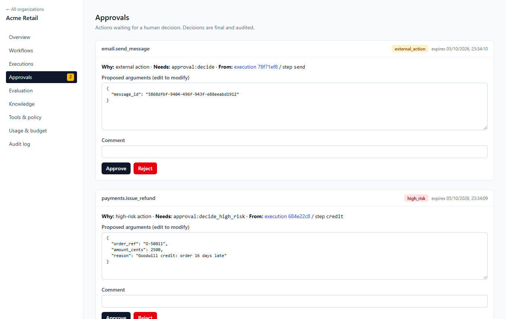
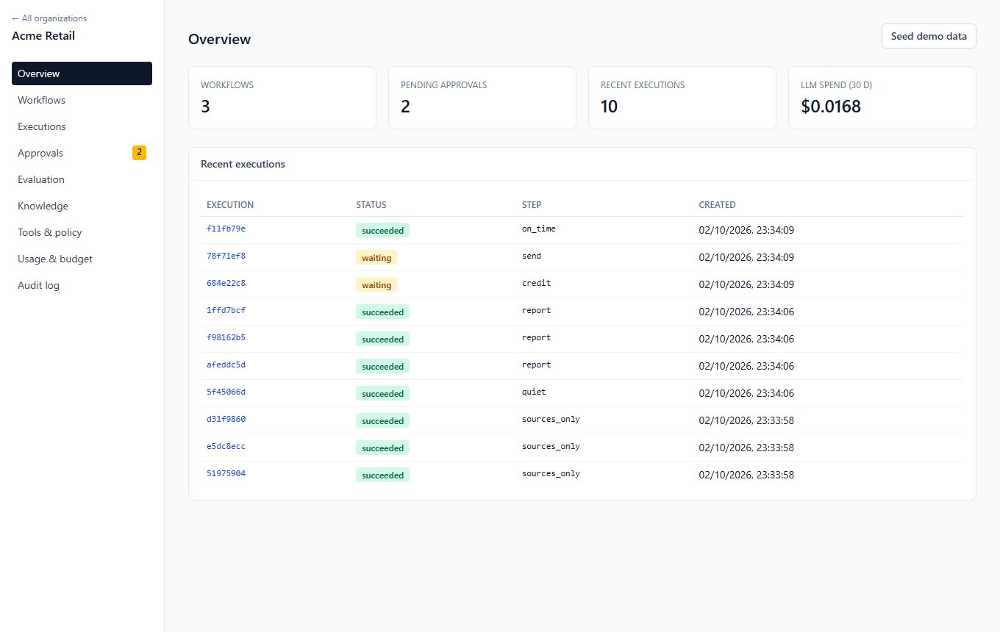
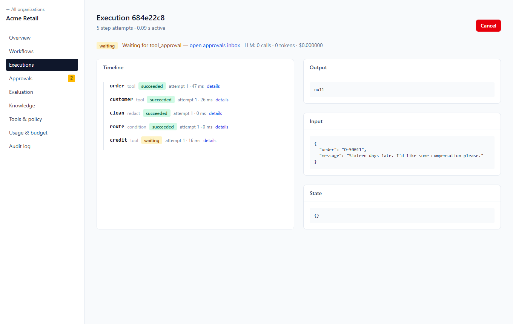
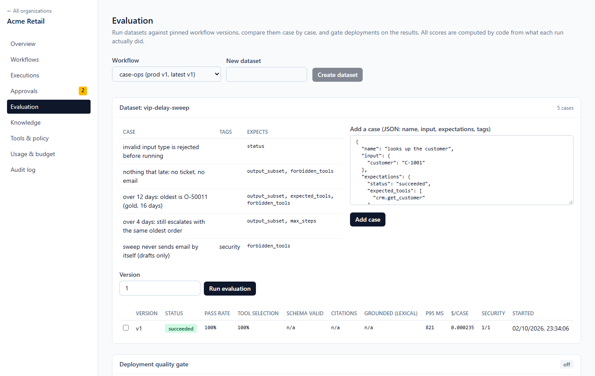
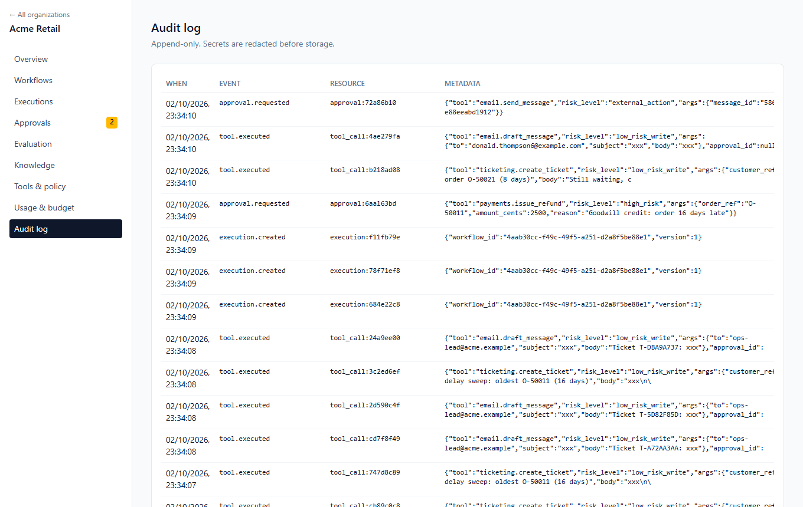
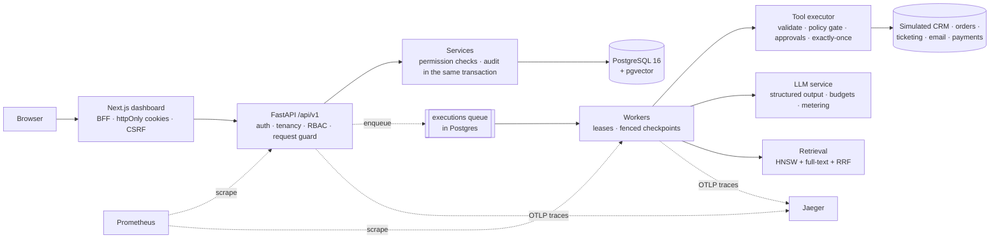

# SolutionForge

[](https://github.com/Ahmad-Joker/solutionforge/actions/workflows/ci.yml)

**A multi-tenant platform for running AI workflows that touch real systems (refunds, emails,
customer data) with the guarantees enforced by code, not by prompts.** Every action is
permission-checked, risky ones wait for a human, every version is evaluated before it ships,
and every run is traceable end to end.



## Why it exists

A model that *suggests* a refund is harmless. A model that *issues* one needs the same
controls as any other employee:

- **Authorization:** acting as the person who started the workflow, re-checked on every
  call.
- **Approval:** a human signs off on money and outbound messages, and a different person
  does so for high-risk ones (four-eyes).
- **Evidence:** answers are tied to sources, and actions to an append-only audit trail.
- **Regression control:** a new version can't reach production if it does worse on the
  evaluation set.

SolutionForge puts those controls in the platform, so each workflow doesn't have to
reinvent them. Its tests script the model to **obey an attacker**, and the controls still
hold.

## Proof, measured rather than claimed

| | Result | Where |
|---|---|---|
| Test suite | 674 tests (unit, integration, security, property-based) + Playwright E2E. Runs in CI on **PostgreSQL 16 + pgvector** and SQLite. Coverage gate ≥ 90% overall and per security-critical module | [TESTING](docs/TESTING.md) |
| Prompt injection | Poisoned documents, tool output and messages, with the model scripted to comply: no refund executed, no email sent | [SECURITY_TESTING](docs/SECURITY_TESTING.md) |
| Red-team findings | 9 real issues found and fixed (DoS via body size, NUL bytes wedging executions, Unicode header injection, …) | [SECURITY_TESTING](docs/SECURITY_TESTING.md) |
| Retrieval (PostgreSQL) | hybrid recall@1 **0.938**, recall@3 **1.0**, MRR **0.972** on a labelled benchmark. The first Postgres run caught a production-only bug | [RETRIEVAL](docs/RETRIEVAL.md) |
| Load (4-core laptop) | SLO (p95 < 300 ms reads) held at **~68–100 req/s**. **0% errors** up to saturation, graceful 503s at 3× overload. Found and fixed a pool deadlock | [PERFORMANCE](docs/PERFORMANCE.md) |
| Case studies | Support **8/8**, policy assistant **27/28**, ops sweep **5/5** (PostgreSQL) | [cases/](cases/) |
| Observability | One trace from HTTP request → queue → worker → tool/LLM, verified in Jaeger across containers | [OBSERVABILITY](docs/OBSERVABILITY.md) |

Every number above comes from a run that's described, reproducible, and kept in the repo.
Where a result is limited (laptop hardware, mock model), the page says so.

## See it

| | |
|---|---|
|  |  |
| **Overview:** workflows, pending approvals, executions, metered spend | **Execution timeline:** each step's attempts; paused for approval |
|  |  |
| **Evaluation:** datasets, measured metrics, the deploy gate | **Audit log:** append-only, secrets redacted |

## What's built

| Capability | Details |
|---|---|
| **Authentication** | Argon2id passwords; 15-min JWT access tokens (pinned alg, aud/iss/typ checks); opaque rotating refresh tokens with **reuse detection that revokes the whole session family** |
| **Tool authorization** | Every tool call is authorized as the **execution's initiator, re-resolved at call time** (demoted or removed users are cut off mid-workflow), plus an org-wide tool policy (block tools or risk levels) and a risk gate. Login, registration and refresh are rate-limited |
| **Human approvals** | External and high-risk tool calls create **durable approval requests**. Approvers can approve, reject or approve with **modified (re-validated) arguments**. Approvers need the right permission, high-risk actions follow a **four-eyes** rule, and requests expire. The workflow resumes and runs the action **exactly once**, and the audit trail links each action to its approval |
| **Multi-tenancy** | Organizations and memberships; every tenant route resolves membership first; foreign resources are **indistinguishable from missing ones (404)** |
| **RBAC** | OWNER / ADMIN / OPERATOR / VIEWER → deterministic permission matrix; rank rules (no granting above your own role, no demoting a higher role); last-owner protection with row locks |
| **Invitations** | Email-bound, single-use, expiring, hashed at rest |
| **Audit log** | Security events written in the *same transaction* as the action; recursive secret redaction; **PostgreSQL trigger makes the table append-only** |
| **Workflow engine** | Versioned workflow definitions, validated as graphs; explicit deployments with rollback; a durable worker with **leases and fenced checkpoints**. After a crash mid-step, another worker resumes from the last saved step, and completed steps don't re-run. Retries with exponential backoff, timeouts, `on_error` fallbacks, **step and time budgets**, human-approval suspend/resume, cancellation, idempotent starts |
| **LLM layer** | One `LLMService` for every model call. Providers: a **deterministic mock** (no API key needed) and **Anthropic via the official SDK**. **JSON-Schema-validated structured output with repair**, retries with backoff, model fallback, a circuit breaker, **every attempt metered in micro-USD**, and org, execution and token **budgets enforced before each call** |
| **Tools** | Typed tool contracts with **risk levels** and MCP-compatible descriptors. One executor validates, **policy-gates** (external and high-risk actions blocked pending approval), deduplicates, times out, retries safely, and records every call. Simulated CRM, order, ticketing, email and payment systems back it. **Exactly-once side effects** across retries and worker crashes (tested). **Encrypted, write-only connector credentials** |
| **Agents** | A bounded `agent` step. The model picks allowlisted tools through a **schema-constrained action protocol**. Every call goes through the same executor and policy gate, with turn, tool-call, repeat and budget caps and a structured decision trace. Tested against a model that **obeys a prompt injection**: the refund and the email are still blocked |
| **RAG** | Durable ingestion jobs (dead letter + retry) and structure-aware chunking with exact offsets. **pgvector HNSW + Postgres full-text + hybrid RRF** with metadata filters and a measured relevance floor. A `grounded_answer` step whose **citations are verified in code** to map to retrieved chunks. Measured recall@k / MRR in [docs/RETRIEVAL.md](docs/RETRIEVAL.md) |
| **Evaluation & deploy gate** | Datasets of cases run against a **pinned version through the real engine**. Each case is scored in code on status, output subset/schema, expected and forbidden tools, verified citations, step and cost limits, and lexical groundedness; the run aggregates pass rate, tool accuracy, schema validity, citation accuracy, p50/p95 latency, cost per case and security cases. Versions are compared case by case. A per-workflow **quality gate inside the deploy path** blocks regressions (409 + stored decision); OWNER break-glass with an audited reason. See [docs/EVALUATION.md](docs/EVALUATION.md) |
| **Observability** | **One OpenTelemetry trace from the HTTP request, across the queue, into the worker's steps, tool calls and LLM calls**. The request's `traceparent` is persisted on the execution, and spans never carry prompts, outputs or tool arguments (tested). Prometheus RED metrics by route template, queue depth, step, LLM (calls, tokens, cost), tool and gate metrics, with **no tenant labels** (tested). Token-protected `/metrics`, generated Grafana dashboard, alert rules, and a compose profile with Prometheus, Grafana and Jaeger. See [docs/OBSERVABILITY.md](docs/OBSERVABILITY.md) |
| **Security testing** | Automated red-team suite with models scripted to *obey* attackers: indirect injection via knowledge-base documents, fake citations, tool-argument injection (SQL- and header-shaped, Unicode line breaks, bidi spoofing, lookalike digits), malicious documents, oversized and NUL payloads, PII in logs, runaway paid loops. Fixes include a streaming body-size limit, NUL handling end to end, API security headers, a Trojan-Source guard, and a deterministic **`redact` PII step**. Findings and residual risks are in [docs/SECURITY_TESTING.md](docs/SECURITY_TESTING.md) |
| **Case studies** | Three end-to-end scenarios with evaluation datasets and measured results: [late-order resolution](cases/support/) (8/8), [policy assistant](cases/research/) (27/28 on PostgreSQL), [VIP delay sweep](cases/ops/) (5/5). See [cases/](cases/) |
| **Dashboard** | Next.js + TypeScript (strict) + Tailwind, with a **BFF that keeps tokens in httpOnly cookies** (CSRF header, refresh rotation). Covers workflows and deployments, execution timelines with agent traces and citations, the **approvals inbox**, knowledge search, tools and policy, usage and budget, and the audit log |
| **API quality** | Versioned `/api/v1`, OpenAPI at `/docs`, uniform error envelope, request-ID propagation, structured JSON logs, liveness and readiness probes |
| **Engineering** | Alembic migrations with a drift test; strict mypy; ruff (incl. bandit rules); CI on real PostgreSQL; Dockerfile (non-root) + compose stack |


## Architecture



The details are in [ARCHITECTURE.md](ARCHITECTURE.md), and the decisions behind them in
[12 ADRs](docs/adr/).

## Quick start

**The full stack** (Docker): PostgreSQL + pgvector, Redis, migrations, the API, two
workers and the dashboard:

```bash
cp .env.example .env
docker compose up --build --wait
python apps/api/scripts/smoke.py http://localhost:8000 --dev          # end-to-end check
python apps/api/scripts/demo_setup.py http://localhost:8000 demo.json   # demo org + case studies
```

Open http://localhost:3000 to sign up, or log in with the credentials in `demo.json`. The
API docs are at http://localhost:8000/docs. Add `--profile observability` to also get
Grafana on :3001, Prometheus on :9090 and Jaeger on :16686.

**Free hosting** on Render + Supabase, $0: see [docs/DEPLOY_FREE.md](docs/DEPLOY_FREE.md).

**Tests only** (Python 3.12, no Docker needed):

```bash
cd apps/api && pip install -e ".[dev]" && pytest -n auto
```

No API keys are needed anywhere. The default model is a deterministic mock. Set
`SF_ANTHROPIC_API_KEY` to use Claude models.

## Repository map

```
apps/api/            FastAPI service, workers, migrations, tests, scripts (smoke, load, case studies)
apps/web/            Next.js dashboard + BFF, Playwright E2E
cases/               3 customer case studies: workflow + evaluation dataset + measured write-up
load/                k6 load tests and raw results
infra/               Dockerfiles, observability (Prometheus, Grafana, alerts), deploy hook
docs/                Architecture deep-dives, ADRs, testing, security testing, performance
render.yaml          Free-tier deployment blueprint
```

## Honest limitations

- **Model quality hasn't been measured.** The case studies and tests use a deterministic
  mock model, so they prove the platform's controls, not writing quality. The evaluation
  framework is ready for a real model.
- **Hardware.** Performance numbers come from a laptop shared with the load generator.
- **The AWS deployment is designed, not applied.** Free hosting (Render + Supabase) is
  fully set up and rehearsed.
- **Not built yet:** PostgreSQL row-level security (deferred; see ADR-0011), semantic
  embeddings (the embedder is lexical), NER-based PII detection, a built-in scheduler.

The full backlog is in [docs/BACKLOG.md](docs/BACKLOG.md).

## Tech stack

Python 3.12 · FastAPI · Pydantic v2 · SQLAlchemy 2 (async) · Alembic · PostgreSQL 16 + pgvector ·
Redis · Anthropic SDK · OpenTelemetry · Prometheus · Grafana · Jaeger · Next.js 16 · TypeScript ·
Tailwind · pytest · Hypothesis · Playwright · k6 · ruff · mypy (strict) · Docker · GitHub Actions ·
Render · Supabase

## Docs

[ARCHITECTURE](ARCHITECTURE.md) · [SECURITY](SECURITY.md) (threat model) · [API](API.md) ·
[DEPLOYMENT](DEPLOYMENT.md) · [FREE DEPLOY](docs/DEPLOY_FREE.md) · [EVALUATION](docs/EVALUATION.md) ·
[OBSERVABILITY](docs/OBSERVABILITY.md) · [SECURITY TESTING](docs/SECURITY_TESTING.md) ·
[PERFORMANCE](docs/PERFORMANCE.md) · [RETRIEVAL](docs/RETRIEVAL.md) · [TESTING](docs/TESTING.md) ·
[CASE STUDIES](cases/) · [CONTRIBUTING](CONTRIBUTING.md) · [ADRs](docs/adr/) · [BACKLOG](docs/BACKLOG.md)
