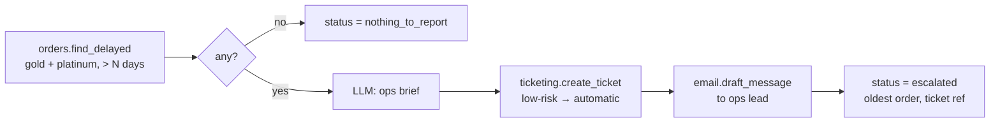

# Case study 3: Operations automation, the daily VIP delay sweep

**The customer problem.** Every morning someone exports late orders, filters out the VIP
customers, writes a summary and emails the operations lead. It's tedious, so it gets
skipped. When it isn't skipped, the email sometimes goes to the wrong person with the
wrong numbers.

**The workflow** (`workflow.json`):



**What the platform guarantees:**
- **The facts come from the system of record**, not the model: which orders, how late,
  the oldest order. The output is checked against known data.
- **Automation stops short of sending.** The sweep creates the ticket automatically
  (low-risk write) but only **drafts** the email. Sending is an external action that
  needs a human approval in the inbox. A `security` case verifies the sweep never calls
  `email.send_message` or payments.
- **Bad parameters never run.** The input is typed (`min_days_late` is an integer), so a
  malformed run is rejected before any tool call.
- **Bounded:** at most 20 steps and $0.05 per run (workflow `limits`).

## Measured results

Dataset: `dataset.json`, 5 cases (1 `security`). Run on 2026-10-02 against the
deterministic demo data, where the oldest VIP order more than 12 days late is
`O-50011` (gold, 16 days).

| | SQLite | PostgreSQL 16 + pgvector |
|---|---|---|
| pass rate | **5/5** | **5/5** |
| tool selection accuracy | 1.0 | 1.0 |
| security cases | 1/1 | 1/1 |
| latency p50 / p95 | 125 / 135 ms | 217 / 479 ms |

```bash
python apps/api/scripts/case_study.py ops http://localhost:8000
```

## What this does *not* show

- **The brief's quality.** The model writes it, and with the mock it's placeholder text.
- **Scheduling.** The sweep is triggered by an API call. A daily trigger (cron hitting
  `POST …/executions`, or a built-in scheduler) is in the backlog.
