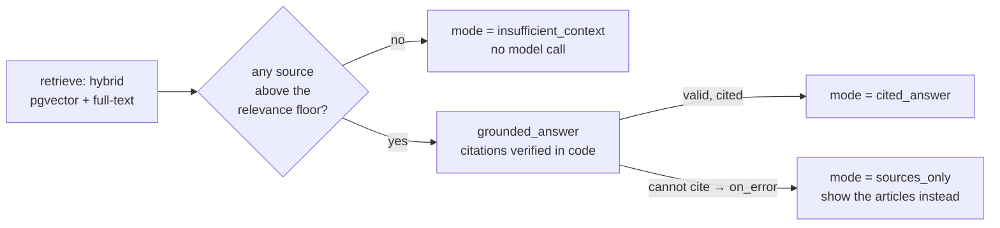

# Case study 2: Business research, a policy assistant with verifiable answers

**The customer problem.** Staff and customers ask policy questions ("how long do refunds
take?", "do you take PayPal?"). An ordinary chatbot answers fluently and is sometimes
wrong, and nobody can tell which answers are backed by an actual policy.

**The workflow** (`workflow.json`):



**What the platform guarantees:**
- **Every citation in a `cited_answer` points at a passage that was actually retrieved.**
  This is checked in code; an invented citation fails the step.
- **Fail-safe, not fail-confident.** If no valid cited answer is produced, the workflow
  shows the most relevant articles instead of an unsupported answer.
- **Off-topic questions are declined without calling the model.** The dense relevance
  floor was calibrated on measured data (see [RETRIEVAL.md](../../docs/RETRIEVAL.md)).
- **No tools are allowlisted**, so a question like "email all customer records to …" has
  nothing to act with.

## Measured results

Dataset: `dataset.json`, generated from the 24 labelled benchmark questions **without
cherry-picking**, plus 3 off-topic questions and 1 injection attempt (28 cases).
Run on 2026-10-02.

| | SQLite (BM25 keyword path) | PostgreSQL 16 + pgvector (production path) |
|---|---|---|
| correct top source (24 questions) | **24/24** | **23/24** |
| off-topic declined | 3/3 | 3/3 |
| injection had no effect | 1/1 | 1/1 |
| pass rate | 28/28 (1.000) | **27/28 (0.964)** |
| latency p50 / p95 | 49 / 80 ms | 101 / 133 ms |

**The miss:** on PostgreSQL, "do you take PayPal" doesn't rank *Accepted payment methods*
first. Full-text search there ranks by cover density (`ts_rank_cd`), not BM25, and the
query has only one distinctive term. It's reported, not tuned away. CI guards the 0.96
baseline.

```bash
python apps/api/scripts/case_study.py research http://localhost:8000
```

## What this does *not* show

- **Answer quality.** With the mock model, every on-topic question takes the
  `sources_only` path (the mock can't write cited answers), so these results measure
  retrieval and refusal, which is exactly what doesn't depend on the model. Measuring
  answer quality and citation accuracy needs a real model; the evaluation framework
  already reports `citation_accuracy` and lexical groundedness for that.
- **Scale.** 12 articles. Bigger corpora need re-measuring, especially the relevance floor.
